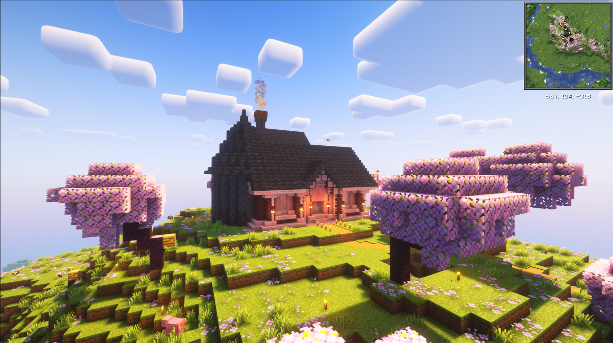
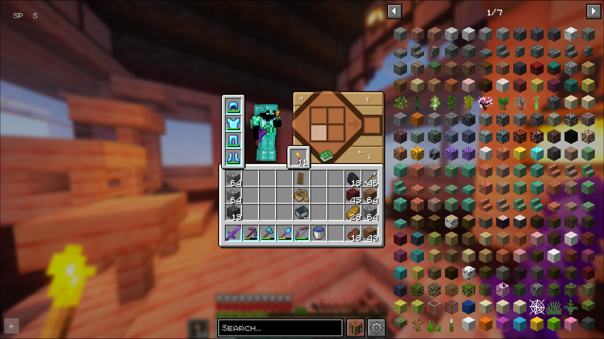

<!-- Oraclecraft Logo -->

  

<h1 align="center">Oraclecraft – Vanilla+ Minecraft Modpack</h1>

  A carefully curated <strong>Vanilla+</strong> experience for Minecraft 1.21.4 using Fabric, Prism Launcher, and over 200 mods.  
  Balances quality-of-life improvements, aesthetic upgrades, and performance tweaks while staying true to Minecraft’s core feel.

---

## Features

- **Vanilla+ Philosophy** – Enhances gameplay without overhauling the core mechanics.
- **200+ Mods** – Performance, quality-of-life, visuals, and light content additions.
- **Curated Resource Packs** – Custom textures for atmosphere and clarity.
- **Shader Support** – Hand-picked shaders for beauty without killing FPS.
- **Balanced Updates** – Runs on 1.21.4 for mod compatibility without being outdated.
- **Prism Launcher Ready** – Simple setup & modular customization.

---

## Screenshots

  
  

> *Screenshots taken with recommended shader + resource pack combo included in this pack.*

---

## Pack Contents

| Category        | Contents |
|-----------------|----------|
| **Mods**        | 200+ curated Fabric mods for performance, QoL, and light content |
| **Resource Packs** | Hand-picked visual enhancements for immersion & clarity |
| **Shader Packs**   | Balanced between beauty and performance |
| **Configs**        | Pre-tuned settings for smooth gameplay |

---

# Installation & Setup

## Requirements
- **Minecraft**: 1.21.4
- **Mod Loader**: Fabric (included in pack)
- **Java**: 17+ recommended
  
## Optional
- **Launcher**: [Prism Launcher](https://prismlauncher.org/)

---

## Quick Install
1. Download the latest release from the [Releases](../../releases) page.
2. Open Prism Launcher → *Add Instance* → *Import from ZIP*.
3. Select the downloaded Oraclecraft ZIP.
4. Adjust RAM allocation (4–8GB recommended).
5. Launch and enjoy.

---

## Manual Install
If you want to build it yourself:
1. Install Prism Launcher.
2. Create a Fabric instance for MC 1.21.4.
3. Copy contents of `mods/`, `resourcepacks/`, and `shaderpacks/` into your instance.
4. Apply config files in `config/` for optimal performance.

---

## Version Choice – Why 1.21.4?
Oraclecraft targets **1.21.4** as a sweet spot:
- **Not bleeding edge** – avoids mod breakage from latest updates.
- **Broad mod compatibility** – works with most modern Fabric mods.
- **Stable experience** – avoids experimental API churn.

Some older mods (like *Flow*) are not included due to version lock.

---

# Modlist Overview

The full modlist is available in [`modlist.md`](modlist.md), but here’s the breakdown:

- **Performance**: Sodium, Lithium, Starlight, FerriteCore, EntityCulling, etc.
- **QoL**: MouseTweaks, InventorySorter, JEI/REI, Waystones, Xaero’s Minimap.
- **Visuals**: Iris Shaders, Continuity, CIT Resewn, Falling Leaves.
- **Content**: Farmer’s Delight, BetterEnd, Incubation, Comforts.

---

## License
Each mod/resource/shader retains its original license.  
Oraclecraft’s configs, structure, and documentation are licensed under the [MIT License](LICENSE).

---

  Built with ❤️ by  0lswitcher | Powered by Fabric, Iris, and all creators of the mods

