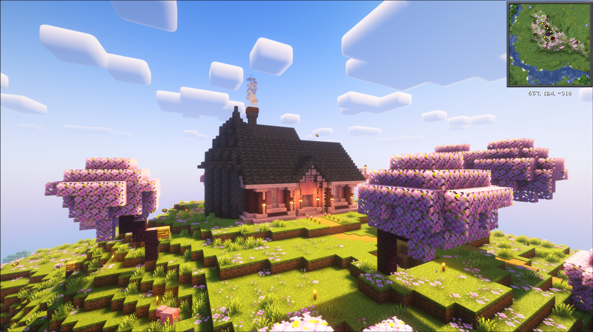
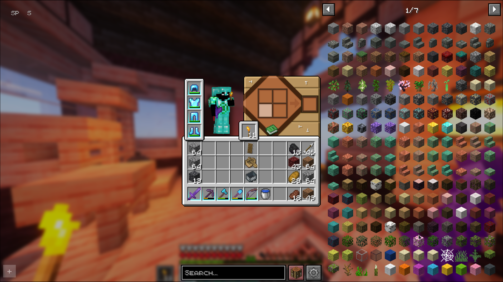

<!-- Oraclecraft Logo -->

  

<h1 align="center">Oraclecraft – Vanilla+ Minecraft Modpack</h1>

  A carefully curated <strong>Vanilla+</strong> experience for Minecraft 1.21.4 using Fabric, Prism Launcher, and over 200 mods.  
  Balances quality-of-life improvements, aesthetic upgrades, and performance tweaks while staying true to Minecraft’s core feel.

---

## Features

- **Vanilla+ Philosophy** – Enhances gameplay without overhauling the core mechanics.
- **200+ Mods** – Performance, quality-of-life, visuals, and light content additions.
- **Curated Resource Packs** – Custom textures for atmosphere and clarity.
- **Shader Support** – Hand-picked shaders for beauty without killing FPS.
- **Balanced Updates** – Runs on 1.21.4 for mod compatibility without being outdated.
- **Prism Launcher Ready** – Simple setup & modular customization.

---

## Screenshots

  
  

> *Screenshots taken with recommended shader + resource pack combo included in this pack.*

---

## Pack Contents

| Category        | Contents |
|-----------------|----------|
| **Mods**        | 200+ curated Fabric mods for performance, QoL, and light content |
| **Resource Packs** | Hand-picked visual enhancements for immersion & clarity |
| **Shader Packs**   | Balanced between beauty and performance |
| **Configs**        | Pre-tuned settings for smooth gameplay |

---

# Installation & Setup

## Requirements
- **Minecraft** (1.21.4)
- **[Fabric](https://fabricmc.net/use/installer/)**  (mod loader)
- **Fabric API** (included in pack)
- **Java** (17+ recommended)
  
## Optional
- **[Iris & Sodium](https://www.irisshaders.dev/download)** (shaders and performance increase, HIGHLY RECOMMENDED-thus prepackaged)
- **[Prism Launcher](https://prismlauncher.org/)** (just an awesome launcher for UNIX systems i'd like to share)

---

## Quick Install
1. Download the latest release from the [Releases](../../releases) page.
2. Open Prism Launcher → *Add Instance* → *Import from ZIP*.
3. Select the downloaded Oraclecraft ZIP.
4. Adjust RAM allocation (4–8GB recommended).
5. Launch and enjoy.

---

## Manual Install
If you want to build it yourself:
1. Ensure [Fabric](https://fabricmc.net/use/installer/) is installed
2. Create a Fabric instance for MC 1.21.4.
3. Copy contents of `mods/`, `resourcepacks/`, and `shaderpacks/` into your instance.
4. Apply config files in `config/` for optimal performance.

---

## Why 1.21.4?
New enough to have modern minecraft features but stable (or old ig) enough to still work with most mods.

> Some older mods (like *Flow*) are not included due to this version choice, but I'll periodically update Oraclecraft once enough notable mods catch up with enough notable official mc releases.

---

# Modlist Overview

The full modlist is available in [`modlist.md`](modlist.md), but here’s a quick overview:

- **Performance**: Sodium, Lithium, Starlight, FerriteCore, EntityCulling, etc.
- **QoL**: MouseTweaks, InventorySorter, REI(JEI alt.), HorseBuff, Xaero’s Minimap, etc.
- **Visuals**: Iris Shaders, Continuity, CIT Resewn, Falling Leaves, BetterF3, etc.

---

## License
Each mod/resource/shader retains its original license.  
Oraclecraft’s configs, structure, and documentation are licensed under the [MIT License](LICENSE).

---

  Built with ❤️ by  0lswitcher | Powered by Fabric, Iris, and all creators of the mods

